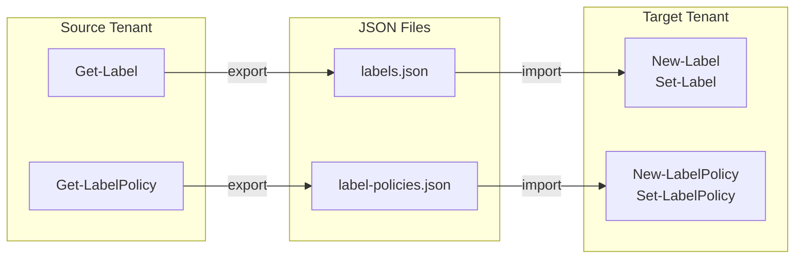

# Architecture

## Overview

Purview Sensitivity Label Sync is three PowerShell files with no build step:

```text
purview-sensitivity-label-sync/
  LabelHelpers.psm1     # Shared module
  Export-Labels.ps1      # Export script
  Import-Labels.ps1      # Import script
```

Both scripts import `LabelHelpers.psm1` at startup. The module provides connection management, structured logging, and the conversion/parameter-building logic.

## Data flow



## Cross-tenant key: \_LabelPath

GUIDs are tenant-specific and cannot be preserved across tenants. Purview Sensitivity Label Sync uses a compound `_LabelPath` as the cross-tenant identifier:

- **Parent labels**: `_LabelPath` = `DisplayName` (e.g. `Confidential`)
- **Sub-labels**: `_LabelPath` = `Parent\Child` (e.g. `Confidential\All Employees`)

This handles the common case where sub-labels share a DisplayName under different parents. For example, "Anyone (not protected)" may exist under both "Confidential" and "Highly Confidential".

## Import phases

The import runs in three sequential phases:

1. **Parent labels** - Created first so their GUIDs exist in the target tenant
2. **Sub-labels** - Created with `ParentId` resolved from the parent's DisplayName in the target tenant
3. **Policies** - Created with label GUIDs resolved from `_LabelPath` lookups against the target tenant

## Policy label resolution

The `Policy.Labels` array from `Get-LabelPolicy` may contain a mix of GUIDs and label Name values (some labels use a Name that matches their DisplayName rather than a GUID format). The export builds two lookup tables:

- `GuidToLabelPath` - maps label GUIDs to their `_LabelPath`
- `NameToLabelPath` - maps label Names to their `_LabelPath`

Both are tried during policy export to ensure all references resolve.

## AdvancedSettings

`New-Label` and `New-LabelPolicy` do not accept the `-AdvancedSettings` parameter. The import creates each label/policy first, then applies advanced settings via `Set-Label` / `Set-LabelPolicy` in a separate call.
